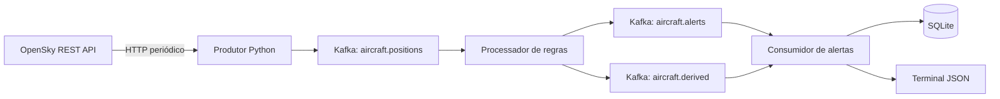

# Arquitetura do AeroMonitor

## Escopo

Monitorar aeronaves em região configurável, inicialmente no entorno de Vitória. O fluxo atende
às três situações simples e à produção de evento derivado do Projeto1.pdf. A ação é persistir
alertas e exibi-los no terminal; um painel gráfico pode ser acrescentado depois.

## Componentes

1. **Produtor:** consulta `/states/all` com bounding box; filtra círculo e idade da posição;
   normaliza campos e publica. Usa relógio UTC local para validar idade, portanto mantenha-o
   sincronizado. Posições repetidas são suprimidas em memória após confirmação Kafka.
2. **Kafka:** um broker/controller KRaft, três tópicos, uma partição por tópico, replicação 1
   e retenção de sete dias. Containers usam `kafka:19092`; host usa `localhost:9092`.
   A porta externa é vinculada ao loopback. Não há autenticação Kafka nesta instalação local.
3. **Processador:** grupo `aeromonitor-processor-v1`; mantém N posições por região/aeronave e
   publica alertas simples ou inferência de aproximação.
4. **Consumidor final:** grupo `aeromonitor-alerts-v1`; consome os dois tópicos de saída,
   grava SQLite e imprime alertas novos. A chave primária impede duplicar um mesmo ID.

## Contratos JSON, versão 1

### Posição

| Campo | Significado |
| --- | --- |
| `event_id` | Região + ICAO24 + instante da posição; determinístico |
| `region_id`, `region_name` | Identificação (preset, centro, raio) e nome do local |
| `icao24`, `callsign` | Transponder e identificação recebida; callsign opcional |
| `observed_at` | `time_position` da fonte, segundos Unix UTC |
| `collected_at` | Instante de coleta, segundos Unix UTC |
| `latitude`, `longitude` | Graus decimais WGS84 |
| `altitude_m` | Altitude barométrica em metros, opcional |
| `on_ground` | Estado em solo informado pela fonte |
| `velocity_ms`, `vertical_rate_ms` | Velocidade e taxa vertical em m/s, opcionais |
| `distance_km` | Distância haversine ao centro |

Todos os eventos têm `schema_version=1`. Chave Kafka: `region_id:icao24`, para ordenar mensagens
da mesma aeronave/região caso o projeto evolua para mais partições. Números não finitos são rejeitados.
Sem altitude, a posição pode ser publicada, mas as regras dependentes dela não são avaliadas.

### Alerta

Inclui `schema_version`, `event_id`, `kind`, região, aeronave, `observed_at`, mensagem e
`source_event_ids`. ID = evento final + regra. A aproximação referencia as N posições que
sustentam a inferência, permitindo rastrear a evidência.

## Processamento temporal

- Três regras simples: proximidade, baixa altitude e taxa vertical; todas exigem voo.
- Aproximação: N observações distintas e ordenadas, com altitude, em voo, reduzindo distância
  e altitude pelos mínimos configurados. Última posição dentro do raio de proximidade.
- Lacunas maiores que o intervalo máximo reiniciam a sequência; eventos fora de ordem são ignorados.
- Cooldown usa tempo do evento, por tipo de alerta e região/aeronave.
- Histórico/cooldown antigos são removidos para limitar a memória.
- Desaparecimento não confirma saída, pouso ou cancelamento.

## Entrega e recuperação

O produtor Kafka usa idempotência e aguarda confirmação. O processador confirma o offset de entrada
**após** publicar as saídas. O consumidor final confirma o offset **após** o commit SQLite.
Falhas Kafka/SQLite encerram o serviço sem confirmar a entrada pendente; o Compose reinicia-o.
Eventos inválidos também causam falha explícita; não há DLQ nesta versão.

Registros podem ser entregues novamente: não há transação única entre tópicos, offsets e SQLite.
O banco deduplica IDs iguais. A impressão não é transacional: interrupção depois de salvar e antes
de imprimir pode deixar o alerta somente no banco.

**Estado temporal em memória:** reinício/rebalanceamento perde histórico e cooldown. A regra
precisa de N novas observações e pode repetir alertas antes do cooldown anterior. Não há recuperação
exata de janelas nem garantia de todos os eventos derivados durante falhas. Evolução sugerida:
checkpoint de estado coordenado com offsets ou reconstrução controlada por replay. Não escalar
processadores antes de tratar essa limitação.

Volumes preservam Kafka e SQLite entre reinícios. Replicação 1 não oferece alta disponibilidade.
A retenção do Kafka é limitada e não substitui um arquivo histórico permanente.

## Região configurável

Uma região é coletada por vez. Alterar `.env` e recriar serviços muda a coleta. O processador usa
região e distância da mensagem, sem recalcular eventos antigos com o centro atual. Os limites das
regras são os da execução atual; não existe versionamento de políticas para replay histórico.

Centros entre -80° e +80°, raio até 200 km, sem cruzar o antimeridiano. Uma região personalizada
não exige código novo. Use centro aeroportuário para dar sentido à inferência de aproximação.
Os presets são pontos aproximados, não geometrias das pistas.

## API, frequência e cobertura

Default anônimo: 240 s; com OAuth2 recomenda-se 30 s para demonstração em uma área pequena.
Até 25 graus quadrados de bounding box custa 1 crédito; áreas maiores custam mais. Regiões
customizadas perto dos polos podem aumentar esse custo. HTTP 429 respeita a espera do servidor;
falhas transitórias usam backoff. Tokens são renovados antes de expirar e uma vez após um 401.

Há lacunas de cobertura, especialmente em baixas altitudes. Um teste com dados recentes não garante
cobertura futura. Não é um sistema oficial de controle de tráfego aéreo. Trajetória e callsign não
confirmam rota comercial/destino. Altitude barométrica não equivale à altura sobre o terreno.

## Validação e próximos passos

Testes offline: dados antigos/nulos, três regras, aproximação, duplicatas, lacunas, regiões,
OAuth2, rate limit e SQLite idempotente. `probe` testa coleta real sem Kafka. CI: Ruff, pytest e
sintaxe do Compose. Possíveis evoluções: mapa, replay identificado, estado persistente, métricas,
DLQ e teste integrado automatizado com broker real.

## Referências

- [OpenSky REST API](https://openskynetwork.github.io/opensky-api/rest.html)
- [OpenSky FAQ](https://opensky-network.org/about/faq)
- [Kafka Docker](https://kafka.apache.org/41/getting-started/docker/)
